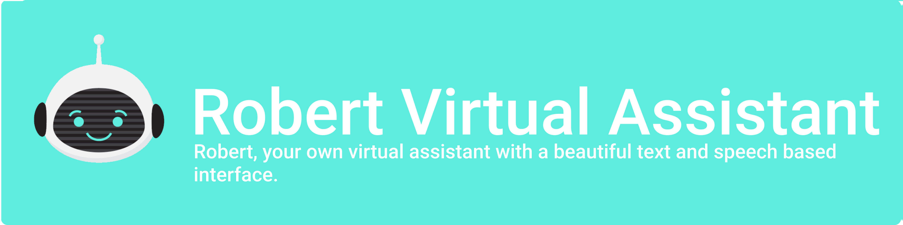
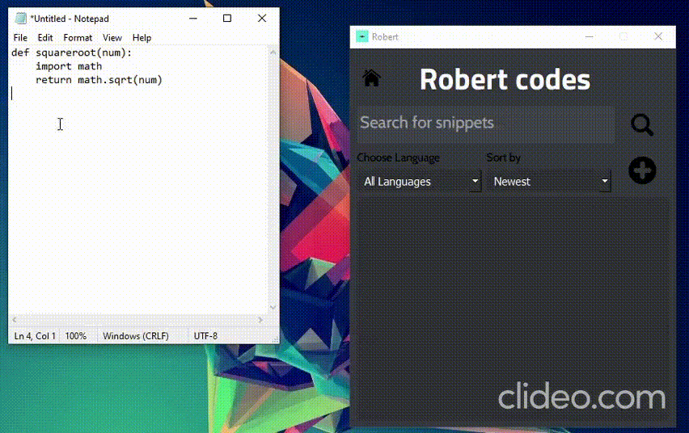
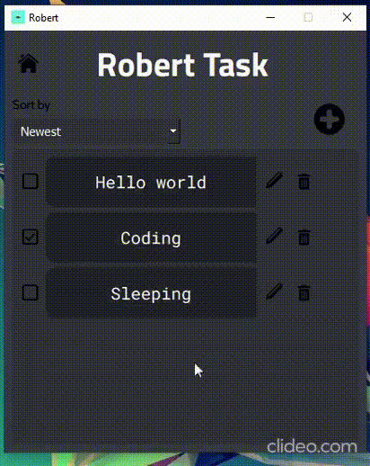
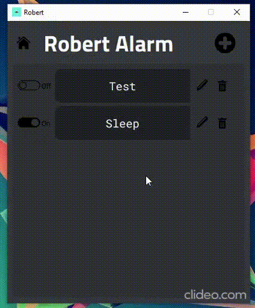
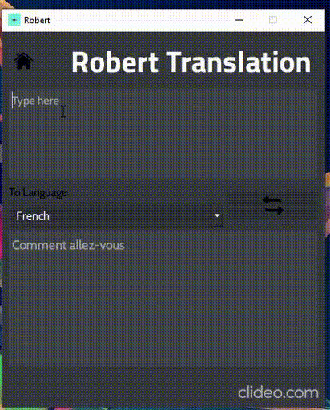
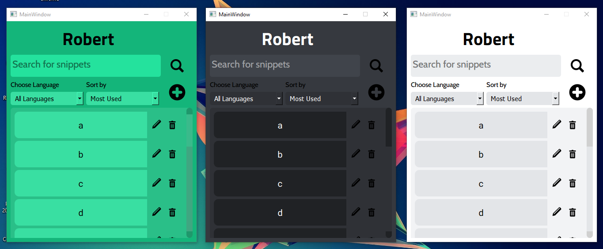

<br />
<p align="center">
    

<h1 align="center">LET'S BEGIN THE JOURNEY</h1>


<p align="center">
    
    
    
    
    
    
    
  </a>
</p>

# About The Project
Robert is a personal assistant with a text and speech based interface that allows you to keep track of your day with a task and alarms manager. With its inbuilt code snippets manager, it allows you to retrieve, create, delete and edit your snippets which prevents repetition. with its 3 themes, it a fit for everybody with different color tastes.
At last but not least you can open the GUI or give commands to Robert without using a mouse but with the hotkeys


# Usage 
- Robert: Robert has its own unique features like Wikipedia: Wikipedia 🎓, open software 🚀, weather ☀️, play music 🎵 and at last the **POWER MODE** 🧪.
- Task Manager: Can't remember the task the boss has given you? Just write them here 📝.
- Alarm: Here is the alarm so you never forget to do something on time ⏰.
- Translation: What's the meaning of that? Just search it here 🌐.
- Code Snippet: Finding your old code on Github, StackOverflow, or in computer files? Save the code snippets which you use the most so you use them at the go! 👨‍💻.
- Setting: let's CHANGE THE COLORS! 🎨.
- And at last, it has hotkeys too so want to give commands by summoning Robert! or open the home page GUI! ⌨️.

### Robert
The main heart of the project and the basically it does the everything say to him you can give him commands as commander by pressing a hotkey which is `shift+7` or by right-clicking on this icon in the system tray as shown here and selecting the **Robert Listner**:- 

 

So let me tell you all the things it can do or the things you can do by speaking are Wikipedia, open youtube, open google (I know this one is funny but what goes to add it and it funny to mention it 😅), open Gmail, show weather, tell time, tell day, tell the date, who are you, who made you, open StackOverflow, news, open cmd, open calculator, do a search, take a screenshot, play music, open notepad and THE POWER MODE (It is a simple thing you can ask the Robert any scientific question 😋).

### **CODE SNIPPET**
Here is your most useful thing! So honestly tell me how many times you ever search for a code that has some lines of code or a project on Github in which you have used a module and you can't remember what module was it and how you used it (I know everyone has done this in there life if you didn't then you are a noob!), So this is the best thing for this type of situation it will store the code in the database and which you can just sync or make a list for it so you can never lose the code. It is easy to open the code snippet thing right click on that icon in the system tray that I have mentioned earlier and choose the **Home Page** or press shift+tab+6 and you will get the code snippet GUI button in the front from there you can access the code snippet GUI and there you can select the files of any language and later on you can sort them, name the code snippet and to just access the code press on the code's name and it will be copied to your clipboard and then you can just past it and do whatever you want!
If you didn't understand then see this:-



### Task Manger
So here comes the GUI's. They have very good things and we thought why not give you guys a task manager like if you forgot that today is your's mom's or her's 😉 birthday eh leave it like you miss a task or your angry boss gave you a lot of tasks and your lazy brain can't handle them then just write them down so you don't forget the task and you don't get fired from the company (I have done research there are fewer chances to get fired by forgetting the task 🤣). And you can edit the task name, description, and priority.



### Alarm
The name is self-explanatory, If your little brain can't understand what it is so it is <a href="https://www.google.com/search?rlz=1C1CHBD_enIN916IN916&ei=oF8WYIHaA8LFz7sPzfeGuAE&q=alarm+meaning&oq=alarm+meaning&gs_lcp=CgZwc3ktYWIQAzIICAAQsQMQkQIyBQgAEJECMgIIADICCAAyAggAMgIIADICCAAyAggAMgIIADICCAA6BAgAEEc6BwgAELEDEEM6BQgAELEDUIIMWKgXYI8ZaABwAngCgAGuAogB6wqSAQcwLjYuMS4xmAEAoAEBqgEHZ3dzLXdpesgBCMABAQ&sclient=psy-ab&ved=0ahUKEwiBqoCl1sXuAhXC4nMBHc27ARcQ4dUDCA0&uact=5" target="_blank">alarm</a>. And you can set the alarm up give it the timing when to ring the alarm and when the alarm matches the time you set, It will give you a notification and will ring a beep sound, So you never forget to do the work on time.



### Translation
As straight out of the word as it sounds. You might often face some foreign or new words that you have never met before. So here it is your translator for the same.



### Settings 
Simply you can change the theme of the GUI.



## Installation
Now your mind will be saying so how to get this thing so here is it:-
For installing the whole project the you must need <a href="https://www.python.org/downloads/">Python</a> and <a href="https://git-scm.com/downloads">Git</a>.
```
# Clone the repo (Open your Terminal, navigate to your preferred directory and execute)
git clone https://github.com/Champions-clan/Robert-Assistant

# Cd into the directory 
cd Robert-Assistant

# Install the requirements (Install all the dependencies, might take time depending on your internet speed)
pip install -r requirements.txt

# Run the bad boy
pythonw Main.py
```
Keep in mind that it is a background script so see your taskbar there you will find the icon in the system tray and first the GUI will open after closing the GUI you can give commands to the Robert but to give the Roberts command again just use the hotkey `<shift>+7` or that icon in the system tray and to open the GUI just right click on the icon in the system tray or press the hotkey `<shift>+6`.

Now enjoy the project 😉.

## Contributions
So you want to make an improvement or want to make a whole new feature? Well, we also want to see that how we have impacted the community or how the community can improve this project for different uses. However, as this project is a part of **Third Timathon Code Jam**, we are not allowed to make any changes to the project after the submission time ends. So, we won't be merging any pull requests. But after the jam finishes. PR's will be accepted.

## Champions Clan
We are four!

- Rajvir Singh aka <a href="https://github.com/RajvirSingh1313">RajvirSingh1313</a>
- Abdella Solomon aka <a href="https://github.com/Abdesol">Abdesol</a>
- Dawn Saju aka <a href="https://github.com/dawntom2006">dawntom2006</a>
- Harsh Pandey aka <a href="https://github.com/akionsight">akionsight</a>

**Created by, with & for the Community**❤
